# 后端

## 1. jwt认证功能

- `utils/jwt_auth.py`,生成token文件

  ```py
  # 生成token文件
  
  import datetime
  
  import jwt
  from django.conf import settings
  
  
  def create_token(payload, timeout=2):
      SALT = settings.SECRET_KEY
      # 构建header
      headers = {
          "alg": "HS256",  # 加密算法
          "typ": "jwt"
      }
  
      # 构建payload
      payload["exp"] = datetime.datetime.now() + datetime.timedelta(weeks=timeout)  # 超时时间
      # print(payload)
      token = jwt.encode(payload=payload, key=SALT, algorithm='HS256', headers=headers)
      return token
  
  ```

- `utils/auth.py`,jwt认证文件

  ```py
  """ 认证模块 """
  import jwt
  from django.conf import settings
  from jwt import exceptions
  from rest_framework.authentication import BaseAuthentication
  from rest_framework.exceptions import AuthenticationFailed
  
  
  class UrlJwtAuthentication(BaseAuthentication):
      """ 认证 请求路径中获取token 都要改成return None """
  
      def authenticate(self, request):
          token = request.query_params.get('token')
          salt = settings.SECRET_KEY
          try:
              payload = jwt.decode(token, salt, ["HS256"])
          except exceptions.ExpiredSignatureError:
              return None
          except jwt.DecodeError:
              return None
          except jwt.InvalidTokenError:
              return None
  
          # 认证通过
          return payload, token
  
  
  class HeaderJwtAuthentication(BaseAuthentication):
      """ 认证 请求头中获取token 都要改成return None """
  
      def authenticate(self, request):
          token = request.META.get('HTTP_AUTHORIZATION')
          # print('tokentokentoken', token)
          salt = settings.SECRET_KEY
          try:
              payload = jwt.decode(token, salt, ["HS256"])
          except exceptions.ExpiredSignatureError:
              return None
          except jwt.DecodeError:
              return None
          except jwt.InvalidTokenError:
              return None
  
          # 认证通过
          return payload, token
  
  
  class NotJwtAuthentication(BaseAuthentication):
      """ 请求头，url中都没有获取到token抛出异常 """
  
      def authenticate(self, request):
          raise AuthenticationFailed({'code': 1002, 'error': "认证失败"})
  
  ```

  


## 2. 注册功能

- 子路由，`api/urls.py`

  ```py
  # from django.urls import path
  from rest_framework import routers
  
  from api import views
  
  router = routers.SimpleRouter()
  
  # 代码省略....
  
  # 用户注册
  router.register(r'register', views.RegisterView, 'register')
  
  urlpatterns = [
  
  ]
  
  urlpatterns += router.urls
  ```

- 视图，`api/views.py`

  ```py
  from .serializers import RegisterSerializer
  
  
  class RegisterView(CreateModelMixin, GenericViewSet):
      """ 用户注册 """
      authentication_classes = []
      serializer_class = RegisterSerializer
  
      def perform_create(self, serializer):
          serializer.validated_data.pop('confirm_password')
          # super().perform_create(serializer)
          serializer.save()
  ```

- 序列化器，`api/serializers.py`

  ```py
  from rest_framework import serializers
  from rest_framework.exceptions import ValidationError
  import re
  
  
  
  class RegisterSerializer(serializers.ModelSerializer):
      """ 用户注册 """
      confirm_password = serializers.CharField(label="确认密码", min_length=6, max_length=16, write_only=True)
      password = serializers.CharField(label="密码", min_length=6, max_length=16, write_only=True)
      sex_text = serializers.CharField(label='性别', read_only=True)
  
      class Meta:
          model = models.UserInfo
          fields = ['username', "password", "confirm_password", 'name', 'sex', 'sex_text', 'phone', 'addr']
  
      def validate_username(self, value):
          exists = models.UserInfo.objects.filter(username=value).exists()
          if exists:
              raise ValidationError("用户名已存在")
          return value
  
      def validate_phone(self, value):
          exists = models.UserInfo.objects.filter(phone=value).exists()
          if exists:
              raise ValidationError("手机号已存在")
          if not re.match(r'^1[3-9]\d{9}', value):
              raise ValidationError("手机号格式错误")
          return value
  
      def validate_confirm_password(self, value):
          password = self.initial_data.get('password')
          if password == value:
              return value
          raise ValidationError("两次密码不一致")
  rname(self, value):
          exists = models.UserInfo.objects.filter(username=value).exists()
          if exists:
              raise ValidationError("用户名已存在")
          return value
  
      def validate_confirm_password(self, value):
          password = self.initial_data.get('password')
          if password == value:
              return value
          raise ValidationError("两次密码不一致")
  
  ```

- `postman`测试

  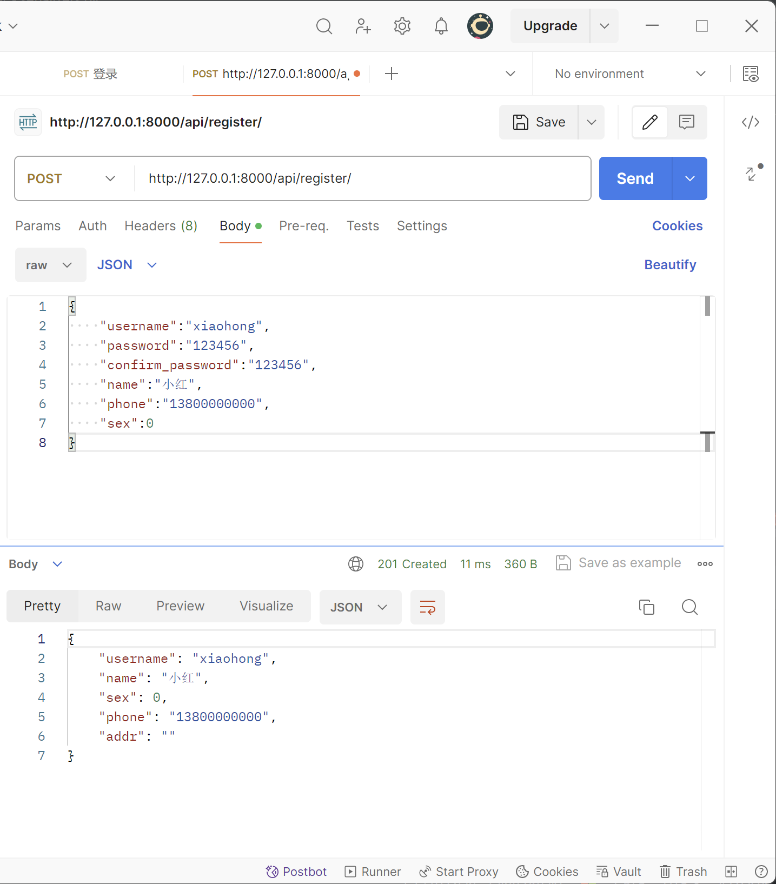


## 3. 登录功能

- 子路由，`api/urls.py`

  ```py
  from django.urls import path
  from rest_framework import routers
  
  from api import views
  
  router = routers.SimpleRouter()
  
  # 代码省略....
  
  urlpatterns = [
      # 用户登录
      path('login/', views.LoginView.as_view())
  ]
  
  urlpatterns += router.urls
  ```

- 视图，`api/views.py`

  ```py
  from rest_framework.response import Response
  from rest_framework.views import APIView
  
  from utils import return_code
  from utils.jwt_auth import create_token
  from . import models
  from .serializers import LoingSerializer
  
  
  class LoginView(APIView):
      """ 用户登录 """
      authentication_classes = []
  
      # 2. 数据库校验用户名和密码的合法性
      def post(self, request):
          # 1. 获取用户请求 & 校验
          serializer = LoingSerializer(data=request.data)
          if not serializer.is_valid():
              return Response({"code": return_code.VALIDATE_ERROR, 'detail': serializer.errors})
  
          username = serializer.validated_data.get('username')
          password = serializer.validated_data.get('password')
  
          user_object = models.UserInfo.objects.filter(username=username, password=password).first()
  
          if not user_object:
              return Response({"code": return_code.VALIDATE_ERROR, "error": "用户名或密码错误"})
  
          # 用户名密码正确生成token
          token = create_token({"user_id": user_object.id, "username": user_object.username})
          return Response({'code': return_code.SUCCESS, 'token': token,
                           'username': user_object.username, 'role': user_object.role})
  
  ```

- 返回码，`utils/return_code.py`

  ```py
  # 验证错误
  VALIDATE_ERROR = 1001
  
  # 成功
  SUCCESS = 0
  ```

  

- 序列化器，`api/serializers.py`

  ```py
  from rest_framework import serializers
  from rest_framework.exceptions import ValidationError
  
  class LoingSerializer(serializers.Serializer):
      """ 用户登录 """
      username = serializers.CharField(label="用户名", write_only=True, required=False)  # 不提交
      password = serializers.CharField(label="密码", min_length=6, write_only=True)
  
      def validate_username(self, value):
          username = self.initial_data.get("username")
          if not username:
              raise ValidationError("用户名不能为空")
          return value
  ```

- `postman`测试

  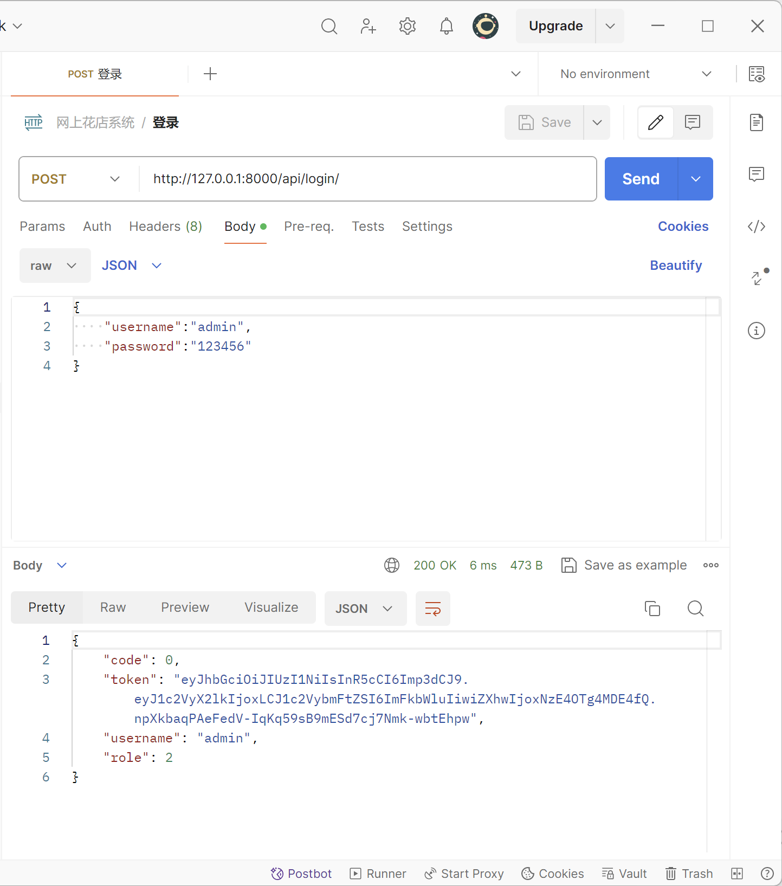


## 4. 鲜花管理（增删查）

- 安装

  ```
  pip install django-filter
  ```

- 配置注册app：

  ```py
  INSTALLED_APPS = [
      ...
      'django_filters',
      ...
  ]
  ```

- `utils/filters.py`

  ```py
  from django_filters import FilterSet, filters
  
  from api import models
  
  
  # 编写搜索条件类
  
  class FlowerFilterSet(FilterSet):
      """ 鲜花搜索 """
      name = filters.CharFilter(field_name="name", lookup_expr="contains")
  
      class Meta:
          model = models.Flower
          fields = ['name']
  
  ```

  

- 子路由，`api/urls.py`

  ```py
  from django.urls import path
  from rest_framework import routers
  
  from api import views
  
  router = routers.SimpleRouter()
  
  # 代码省略....
  
  # 鲜花
  router.register(r'flower', views.FlowerView, 'flower')
  
  urlpatterns = [
      # 代码省略....
  ]
  
  urlpatterns += router.urls
  ```

- 视图，`api/views.py`

  ```py
  from rest_framework.mixins import CreateModelMixin, ListModelMixin,DestroyModelMixin
  from rest_framework.viewsets import GenericViewSet
  from . import models
  from .serializers import FlowerSerializer
  from utils.filters import FlowerFilterSet
  from django_filters.rest_framework import DjangoFilterBackend
  
  
  
  class FlowerView(CreateModelMixin, ListModelMixin, DestroyModelMixin,GenericViewSet):
      """ 鲜花功能：需认证 """
      queryset = models.Flower.objects.all().order_by('-create_time', '-id')
      serializer_class = FlowerSerializer
      filter_backends = [DjangoFilterBackend, ]
      filterset_class = FlowerFilterSet
  
  ```
  
- 序列化器，`api/serializers.py`

  ```py
  from rest_framework import serializers
  
  class FlowerSerializer(serializers.ModelSerializer):
      """ 鲜花序列化器 """
      create_time = serializers.DateTimeField(label='鲜花新增时间', format='%Y-%m-%d %X', read_only=True)
  
      class Meta:
          model = models.Flower
          fields = ['id', 'name', 'stock', 'price', 'image', 'flower_language', 'create_time']
  
  ```
  
- `postman`测试

  新增鲜花
  
  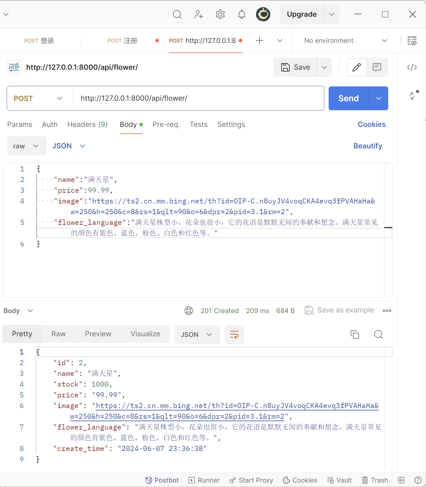
  
  查看鲜花列表
  
  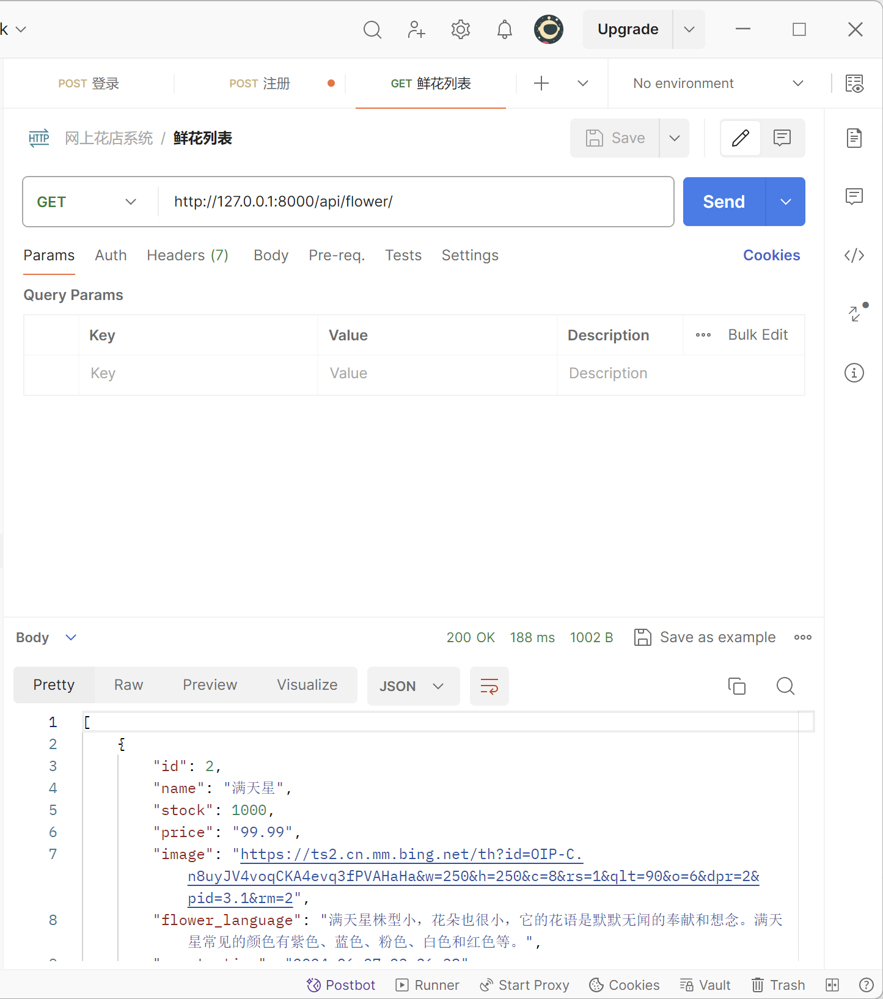
  
  删除鲜花
  
  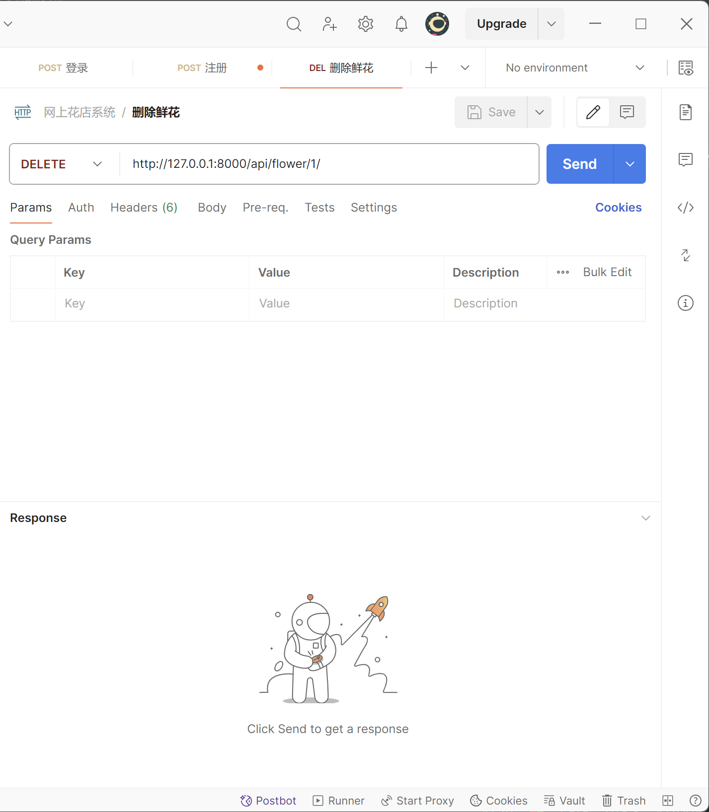


## 5. 用户管理

- 安装

  ```
  pip install django-filter
  ```

- 配置注册app：

  ```py
  INSTALLED_APPS = [
      ...
      'django_filters',
      ...
  ]
  ```

- `utils/filters.py`

  ```py
  from django_filters import FilterSet, filters
  
  from api import models
  
  
  # 编写搜索条件类
  class UserFilterSet(FilterSet):
      """ 用户搜索 """
      username = filters.CharFilter(field_name="username", lookup_expr="contains")
  
      class Meta:
          model = models.UserInfo
          fields = ['username']
  
  ```

  

- 子路由，`api/urls.py`

  ```py
  from django.urls import path
  from rest_framework import routers
  
  from api import views
  
  router = routers.SimpleRouter()
  
  # 代码省略....
  
  # 用户
  router.register(r'user', views.UserView, 'user')
  
  urlpatterns = [
      # 代码省略....
  ]
  
  urlpatterns += router.urls
  ```

- 视图，`api/views.py`

  ```py
  from .serializers import UserSerializer
  
  class UserView(ListModelMixin, DestroyModelMixin, GenericViewSet):
      """ 用户管理 """
      queryset = models.UserInfo.objects.all().order_by('-create_time')
      serializer_class = UserSerializer
      filter_backends = [DjangoFilterBackend, ]
      filterset_class = UserFilterSet
  
  ```

- 序列化器，`api/serializers.py`

  ```py
  class UserSerializer(serializers.ModelSerializer):
      """ 用户管理序列化器 """
      role_text = serializers.CharField(label='角色', source='get_role_display', read_only=True)
      sex_text = serializers.CharField(label='性别', source='get_sex_display', read_only=True)
      create_time = serializers.DateTimeField(label='用户新增时间', format='%Y-%m-%d %X', read_only=True)
  
      class Meta:
          model = models.UserInfo
          fields = ['role_text', 'username', 'name', 'sex_text', 'avatar', 'phone', 'addr', 'create_time']
  
  ```

- `postman`测试

  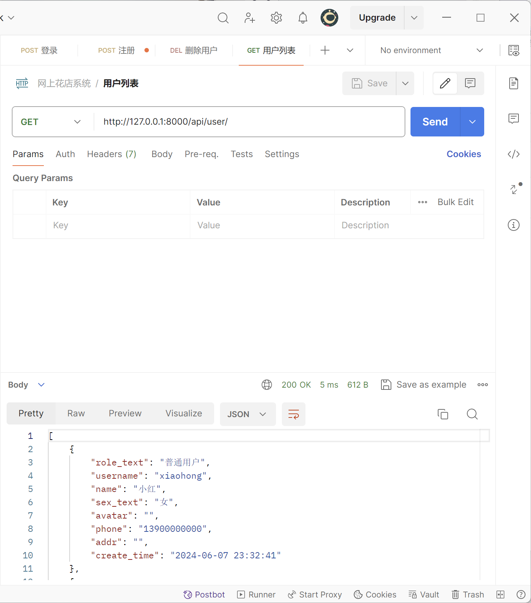

  


## 6. 公告管理

- 安装

  ```
  pip install django-filter
  ```

- 配置注册app：

  ```py
  INSTALLED_APPS = [
      ...
      'django_filters',
      ...
  ]
  ```

- `utils/filters.py`

  ```py
  from django_filters import FilterSet, filters
  
  from api import models
  
  
  # 编写搜索条件类
  class AnnouncementFilterSet(FilterSet):
      """ 公告搜索：根据标题搜索 """
      title = filters.CharFilter(field_name="title", lookup_expr="contains")
  
      class Meta:
          model = models.Order
          fields = ['title']
  
  
  ```

  

- 子路由，`api/urls.py`

  ```py
  from django.urls import path
  from rest_framework import routers
  
  from api import views
  
  router = routers.SimpleRouter()
  
  # 代码省略....
  
  # 公告
  router.register(r'announcement', views.AnnouncementView, 'announcement')
  
  urlpatterns = [
      # 代码省略....
  ]
  
  urlpatterns += router.urls
  ```

- 视图，`api/views.py`

  ```py
  from .serializers import AnnouncementSerializer
  
  class AnnouncementView(CreateModelMixin, ListModelMixin, DestroyModelMixin, GenericViewSet):
      """ 公告管理 """
      queryset = models.Announcement.objects.all().order_by('create_time')
      serializer_class = AnnouncementSerializer
      filter_backends = [DjangoFilterBackend, ]
      filterset_class = AnnouncementFilterSet
  
      def perform_create(self, serializer):
          serializer.save(user_id=self.request.user['user_id'])
  
  ```

- 序列化器，`api/serializers.py`

  ```py
  class AnnouncementSerializer(serializers.ModelSerializer):
      """ 公告序列化器 """
      create_time = serializers.DateTimeField(label='公告新增时间', format='%Y-%m-%d %X', read_only=True)
      username = serializers.CharField(label='用户', source='user.username', read_only=True)
  
      class Meta:
          model = models.Announcement
          fields = ['create_time', 'title', 'content', 'username']
  
  ```

- `postman`测试

  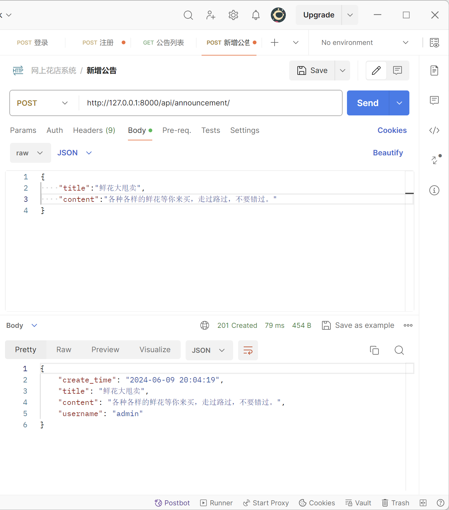


## 7. 轮播图管理

- 子路由，`api/urls.py`

  ```py
  from django.urls import path
  from rest_framework import routers
  
  from api import views
  
  router = routers.SimpleRouter()
  
  # 代码省略....
  
  # 轮播图
  router.register(r'banner', views.BannerView, 'banner')
  
  urlpatterns = [
      # 代码省略....
  ]
  
  urlpatterns += router.urls
  ```

- 视图，`api/views.py`

  ```py
  from .serializers import BannerSerializer
  
  class BannerView(CreateModelMixin, ListModelMixin, DestroyModelMixin, GenericViewSet):
      """ 轮播图管理 """
      queryset = models.Banner.objects.all().order_by('-create_time')
      serializer_class = BannerSerializer
  
      def perform_create(self, serializer):
          serializer.save(user_id=self.request.user['user_id'])
  
  ```

  

- 序列化器，`api/serializers.py`

  ```py
  class BannerSerializer(serializers.ModelSerializer):
      """ 轮播图序列化器 """
      create_time = serializers.DateTimeField(label='轮播图新增时间', format='%Y-%m-%d %X', read_only=True)
      username = serializers.CharField(label='用户', source='user.username', read_only=True)
      image = serializers.CharField(required=True)
  
      class Meta:
          model = models.Banner
          fields = ['create_time', 'image', 'username']
  
  ```
  
- `postman`测试

  

  


## 8. 订单管理

- 安装

  ```
  pip install django-filter
  ```

- 配置注册app：

  ```py
  INSTALLED_APPS = [
      ...
      'django_filters',
      ...
  ]
  ```

- `utils/filters.py`

  ```py
  from django_filters import FilterSet, filters
  
  from api import models
  
  
  # 编写搜索条件类
  class OrderFilterSet(FilterSet):
      """ 订单搜索：根据订单号搜索 """
      order_num = filters.CharFilter(field_name="order_num", lookup_expr="contains")
  
      class Meta:
          model = models.Order
          fields = ['order_num']
  
          
          
  class SelfFilterBackend(BaseFilterBackend):
      def filter_queryset(self, request, queryset, view):
          if request.user['username'] == 'admin':
              return queryset.filter()
          else:
              return queryset.filter(user=request.user['user_id'])
  
  ```

  

- 子路由，`api/urls.py`

  ```py
  from django.urls import path
  from rest_framework import routers
  
  from api import views
  
  router = routers.SimpleRouter()
  
  # 代码省略....
  
  # 订单管理
  router.register(r'order', views.OrderView, 'order')
  
  urlpatterns = [
      # 代码省略....
  ]
  
  urlpatterns += router.urls
  ```

  

- 视图，`api/views.py`

  ```py
  from .serializers import OrderSerializer
  from utils.filters import OrderFilterSet, SelfFilterBackend
  
  
  class OrderView(ListModelMixin, CreateModelMixin, GenericViewSet):
      """ 订单管理 """
      queryset = models.Order.objects.all().order_by('-create_time', '-id')
      serializer_class = OrderSerializer
      filter_backends = [SelfFilterBackend, DjangoFilterBackend, ]
      filterset_class = OrderFilterSet
  
      def perform_create(self, serializer):
          user = self.request.user['user_id']
          flower_id = serializer.validated_data['flower'].id  # 鲜花id
          quantity = serializer.validated_data['quantity']  # 购买鲜花总数量
          flower_object = models.Flower.objects.filter(id=flower_id).first()
          if not flower_object:
              return Response({'code': 3000, 'msg': '该鲜花不存在'})
  
          # 购买数量大于库存量则不可以继续购买
          if quantity > flower_object.stock:
              return Response({'code': 3002, 'msg': f'库存量还剩{flower_object.stock}'})
  
          if flower_object.stock <= 0:
              return Response({'code': 3003, 'msg': '该品种已售馨'})
          order_num = f"{time.strftime('%Y%m%d%H%M%S')}{random.randint(10000000, 99999999)}"
          order_object = models.Order.objects.create(flower_id=flower_id, quantity=quantity,
                                                     total_price=quantity * flower_object.price, user_id=user,
                                                     order_num=order_num)
          flower_object.stock -= quantity
          flower_object.save()
  
          return Response({"code": return_code.SUCCESS, 'data': {'active': True}})
  
  ```
  
  

- 序列化器，`api/serializers.py`

  ```py
  class OrderSerializer(serializers.ModelSerializer):
      """ 订单序列化器 """
      create_time = serializers.DateTimeField(label='下单时间', format='%Y-%m-%d %X', read_only=True)
      order_status_text = serializers.CharField(label='订单状态', source='get_order_status_display', read_only=True)
      flower_text = serializers.CharField(label='鲜花', source='flower.name', read_only=True)
      flower_img = serializers.CharField(label='鲜花', source='flower.image', read_only=True)
  
      class Meta:
          model = models.Order
          fields = ['user', 'create_time', 'flower', 'quantity', 'total_price', 'order_status', 'order_status_text',
                    'flower_text', 'flower_img']
          extra_kwargs = {
              'user': {'read_only': True},
              'total_price': {'read_only': True},
              'order_status': {'read_only': True},
          }
  
  ```

- `post测试`

  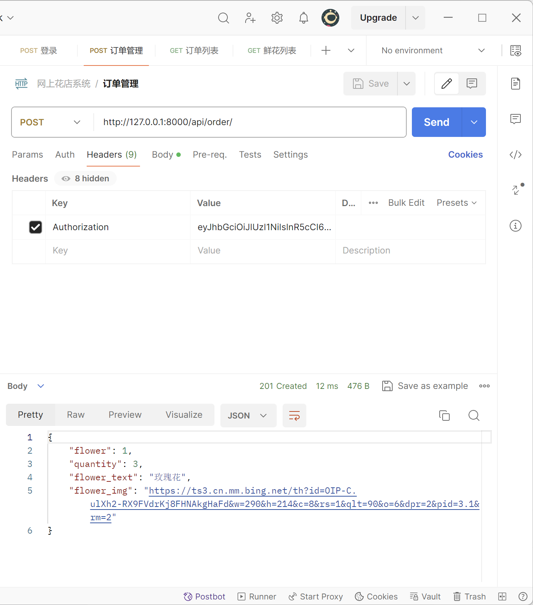


# 前端

## 1. 准备工作

创建文件夹（目录结构）

- 工具文件，配置axios，`src/utils/http.js`

  ```js
  import axios from 'axios'
  
  // 创建axios实例
  const instance = axios.create({
      baseURL: 'http://127.0.0.1:8000/api/',
      timeout: 5000
  })
  
  // axios请求拦截器
  instance.interceptors.request.use(config => {
      config.headers.Authorization = localStorage.getItem('token')
      return config
  }, e => Promise.reject(e))
  
  // axios响应式拦截器
  instance.interceptors.response.use(res => res.data, e => {
      return Promise.reject(e)
  })
  
  
  export default instance
  ```

- 路由配置，`src/router/index.js`

  ```js
  import {createRouter, createWebHistory} from 'vue-router'
  import HomeView from '@/views/blog/HomeView.vue'
  
  const router = createRouter({
      history: createWebHistory(import.meta.env.BASE_URL),
      routes: [
          {
              path: '/',
              name: 'home',
              component: HomeView
          },
      ]
  })
  
  export default router
  ```

  


## 2. 鲜花管理功能实现

- 鲜花管理页面展示

  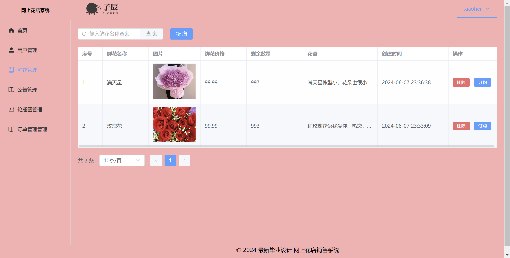

- 添加鲜花页面展示

  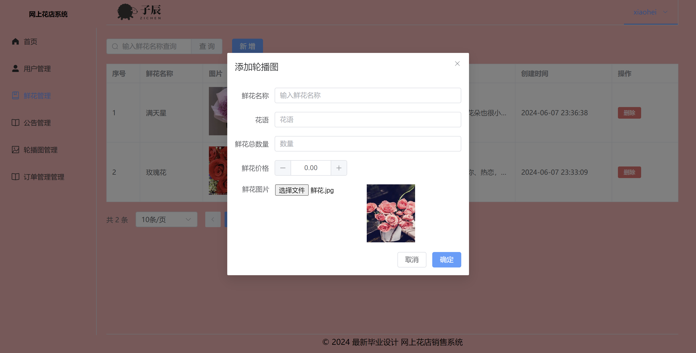

- 请求接口，`src/apis/flower.js`

  ```js
  import instance from "@/utils/http.js";
  
  
  // 搜索鲜花
  export function FlowerRequest(name) {
      return instance({
          url: 'flower/',
          params: {
              name
          }
      })
  }
  
  // 删除鲜花
  export function DelFlowerRequest(id) {
      return instance({
          url: 'flower/' + id + '/',
          method: 'delete'
      })
  }
  
  // 新增鲜花
  export function addFlowerRequest({name, price, image, flower_language,stock}) {
      return instance({
          url: 'flower/',
          method: 'post',
          data: {
              name, price, image, flower_language,stock
          }
      })
  }
  ```

  

- 导航条公共页面编写，`src/views/blog/Layout.vue`

  ```vue
  <template>
      <div class="common-layout">
          <el-container>
  
              <!-- 左侧菜单栏-->
              <el-aside width="200px" >
  
                  <el-col :span="100" style="height: 100vh;">
                      <h5 class="mb-3" style="margin:20px 60px;">网上花店系统</h5>
                      <el-menu
                              :default-active="index"
                              class="el-menu-vertical-demo"
                              background-color="#ffb0b0"
                      >
                          <el-menu-item index="1">
                              <el-icon>
                                  <HomeFilled/>
                              </el-icon>
                              <span @click="goHome">首页</span>
                          </el-menu-item>
  
                          <el-menu-item index="2">
                              <el-icon>
                                  <user-filled/>
                              </el-icon>
                              <span @click="goUser">用户管理</span>
                          </el-menu-item>
  
                          <el-menu-item index="3">
                              <el-icon>
                                  <Collection/>
                              </el-icon>
                              <span @click="goFlower">鲜花管理</span>
                          </el-menu-item>
  
  
                          <el-menu-item index="4">
                              <el-icon>
                                  <Reading/>
                              </el-icon>
                              <span @click="goAnnouncement">公告管理</span>
                          </el-menu-item>
  
                          <el-menu-item index="5">
                              <el-icon>
                                  <Picture/>
                              </el-icon>
                              <span @click="goBanner">轮播图管理</span>
                          </el-menu-item>
  
  
                          <el-menu-item index="6">
                              <el-icon>
                                  <Reading/>
                              </el-icon>
                              <span @click="goOrder">订单管理管理</span>
                          </el-menu-item>
  
                      </el-menu>
                  </el-col>
              </el-aside>
  
              <el-container>
                  <!-- 头部导航条-->
                  <el-header>
                      <el-menu
                              :default-active="activeIndex"
                              class="el-menu-demo"
                              mode="horizontal"
                              :ellipsis="false"
                              background-color="#ffb0b0"
                      >
                          <el-menu-item index="0">
                              
                          </el-menu-item>
                          <div class="flex-grow"/>
                          <el-sub-menu index="2">
                              <template #title>{{ username }}</template>
                              <el-menu-item index="2-2" @click="logout">退出登录</el-menu-item>
                          </el-sub-menu>
                      </el-menu>
                  </el-header>
  
                  <!-- 内容区域-->
                  <el-main>
                      <RouterView></RouterView>
                  </el-main>
  
                  <!--脚部信息-->
                  <el-footer>
                      <div class="footer">
                          © 2024 最新毕业设计 网上花店销售系统
                      </div>
                  </el-footer>
  
              </el-container>
          </el-container>
      </div>
  </template>
  
  <script setup>
  import {ref, onMounted} from 'vue'
  import {useRouter} from "vue-router";
  import {
      HomeFilled,
      Avatar,
      UserFilled,
      Grid,
      Notebook,
      Collection,
      Promotion,
      Reading, Picture
  } from '@element-plus/icons-vue'
  
  
  const router = useRouter()  // 实例化useRouter对象
  // const {role} = useRole()  // 获取当前登录的角色信息
  const activeIndex = ref('2-2')  // 导航条菜单默认激活
  const username = localStorage.getItem('username')  // 获取当前登录人的用户名
  const index = ref('1')  // 左侧栏默认激活
  
  // 退出登录
  function logout() {
      localStorage.clear()
      router.push({path: '/login'})
  
  }
  
  // 页面刷新跳转回首页
  onMounted(() => {
      router.push({path: "/home"})
  })
  
  
  // 跳转到首页
  function goHome() {
      router.push({path: '/home'})
  }
  
  
  // 跳转到用户管理页面
  function goUser() {
      router.push({path: '/user'})
  }
  
  // 跳转到鲜花管理页面
  function goFlower() {
      router.push({path: '/flower'})
  }
  
  
  // 跳转到订单管理页面
  function goOrder() {
      router.push({path: '/order'})
  }
  
  // 跳转到公告页面
  function goAnnouncement() {
      router.push({path: '/announcement'})
  }
  
  // 跳转到轮播图
  function goBanner() {
      router.push({path: '/banner'})
  }
  
  
  </script>
  
  <style scoped>
  .flex-grow {
      flex-grow: 1;
  }
  
  .el-menu {
      background-color: var(--el-menu-bg-color);
      border-right: 1px solid #dcdfe6;
      height: 87%;
      box-sizing: border-box;
      list-style: none;
      margin: 0;
      padding-left: 0;
      position: relative;
  }
  
  .footer {
      text-align: center;
      border-top: 1px solid #dcdfe6;
      height: 30px;
      line-height: 30px;
  }
  
  
  </style>
  ```
  
  
  
- 鲜花管理编辑，`src/views/flower/Flower.vue`

  ```vue
  <template>
      <div class="container">
  
          <div class="nav">
              <div>
                  <el-input v-model="input_flower" style="width: 240px" placeholder="输入鲜花名称查询">
                      <template #prefix>
                          <el-icon class="el-input__icon">
                              <search/>
                          </el-icon>
                      </template>
                      <template #append>
                          <el-button @click="searchFlower">查 询</el-button>
                      </template>
                  </el-input>
              </div>
              <div class="add_btn">
                  <el-button type="primary" class="btn" @click="dialogVisible = true">新 增</el-button>
              </div>
          </div>
  
          <!--表格数据-->
          <div class="table">
              <el-table :data="tableData.slice((currentPage-1)*pageSize,currentPage*pageSize)" border style="width: 100%">
                  <el-table-column label="序号" width="70" type="index" :index="indexMethod" style="background-color: #ffb0b0"/>
                  <el-table-column prop="name" label="鲜花名称" width="130"/>
                  <el-table-column prop="cover_url" label="图片" width="146">
                      <template #default="scope">
                          <el-image style="width: 120px; height: 100px"
                                    :src="scope.row.image"></el-image>
  
                      </template>
                  </el-table-column>
                  <el-table-column prop="price" label="鲜花价格" width="130"/>
                  <el-table-column prop="stock" label="剩余数量" width="160"/>
                  <el-table-column prop="flower_language" label="花语" width="210" show-overflow-tooltip/>
                  <el-table-column prop="create_time" label="创建时间" width="200"/>
  
                  <el-table-column label="操作" width="140">
                      <template #default="scope">
                          <el-button type="danger" @click="deleteFlower(scope.row)" size="small">删除</el-button>
                      </template>
                  </el-table-column>
  
              </el-table>
  
  
              <!-- 页码展示-->
              <div style="margin-top: 20px">
  
                  <el-pagination
                          :current-page="currentPage"
                          :page-size="pageSize"
                          :page-sizes="[10, 20, 30, 40,50]"
                          background
                          layout="total,sizes, prev, pager, next"
                          :total="tableData.length"
                          @size-change="handleSizeChange"
                          @current-change="handleCurrentChange"
                  />
              </div>
          </div>
  
      </div>
  
  
    <!--  添加鲜花-->
      <el-dialog
              v-model="dialogVisible"
              title="添加轮播图"
              width="500"
              :close-on-click-modal="false"
      >
          <template #footer>
              <div class="dialog-footer">
                  <el-form
                          ref="ruleFormRef"
                          style="max-width: 600px"
                          label-width="auto">
  
                      <el-form-item label="鲜花名称" prop="name">
                          <el-input v-model="name" style="width: 100%" placeholder="输入鲜花名称"></el-input>
                      </el-form-item>
  
                      <el-form-item label="花语" prop="flower_language">
                          <el-input v-model="flower_language" style="width: 100%" placeholder="花语"></el-input>
                      </el-form-item>
  
                      <el-form-item label="鲜花总数量" prop="stock">
                          <el-input v-model="stock" style="width: 100%" placeholder="数量"></el-input>
                      </el-form-item>
  
                      <el-form-item label="鲜花价格" prop="price">
                          <el-input-number v-model="price" :precision="2" :step="0.1"/>
                      </el-form-item>
  
                      <div class="btn-addFlower">
                          <span style="color: #606266;font-size: 14px; margin-left: 15px;">鲜花图片</span>
                          <input type="file" style="margin-left: 12px" @change="flowerChange">
                          
                      </div>
  
  
                  </el-form>
  
                  <el-button @click="dialogVisible = false">取消</el-button>
                  <el-button type="primary" @click="addFlower">
                      确定
                  </el-button>
              </div>
          </template>
      </el-dialog>
  
  </template>
  
  <script setup>
  import {ref, onMounted} from "vue";
  import {ElMessage} from "element-plus";
  import {FlowerRequest, DelFlowerRequest, addFlowerRequest} from "@/apis/flower.js";
  import {Search} from "@element-plus/icons-vue";
  import usePage from "@/hooks/usePage.js";
  
  
  // 查询输入框
  const input_flower = ref('')
  const tableData = ref([])  // 表格数据
  const {
      pageSize,
      currentPage,
      handleSizeChange,
      handleCurrentChange,
      indexMethod
  } = usePage()  // 分页
  const dialogVisible = ref(false)  // 弹出框
  const previewImg = ref('')  // 预览图
  const name = ref('')  // 鲜花名
  const flower_language = ref('')  // 花语
  const price = ref('')  // 价格
  const stock = ref('')  // 添加鲜花数量
  
  async function flowerChange(e) {
      const file = e.target.files[0];
      // 创建文件读取器
      const reader = new FileReader();
      reader.onload = e => {
          const dataUrl = e.target.result
          previewImg.value = dataUrl
      }
      // 以DataUrl格式读取文件
      reader.readAsDataURL(file);
  }
  
  // 新增鲜花
  async function addFlower() {
      const res = await addFlowerRequest({
          name: name.value,
          price: price.value,
          flower_language:flower_language.value,
          image:previewImg.value,
          stock:stock.value
      })
      ElMessage.success('添加成功')
      dialogVisible.value = false
      getFlowerList()
  
  }
  
  
  // 发送请求获取轮播图列表
  async function getFlowerList() {
      const res = await FlowerRequest()
      tableData.value = res
      console.log(res)
  }
  
  onMounted(() => getFlowerList())
  
  // 删除逻辑
  async function deleteFlower(row) {
      await DelFlowerRequest(row.id)
      getFlowerList()
      ElMessage({
          type: "success",
          message: '删除成功'
      })
  }
  
  
  // 查询功能
  // 根据鲜花名称进行查询
  async function searchFlower() {
      const res = await FlowerRequest(input_flower.value)
      tableData.value = res
  }
  
  </script>
  
  <style scoped>
  
  
  .btn {
      margin-bottom: 20px;
  }
  
  .avatar-uploader .avatar {
      width: 150px;
      height: 150px;
      display: block;
  }
  </style>
  
  <style>
  .avatar-uploader .el-upload {
      border: 1px dashed var(--el-border-color);
      border-radius: 6px;
      cursor: pointer;
      position: relative;
      overflow: hidden;
      transition: var(--el-transition-duration-fast);
  }
  
  .avatar-uploader .el-upload:hover {
      border-color: var(--el-color-primary);
  }
  
  
  .block .demonstration {
      display: block;
      color: var(--el-text-color-secondary);
      font-size: 14px;
      margin-bottom: 20px;
  }
  
  .nav {
      display: flex;
      flex-direction: row;
  }
  
  .add_btn {
      margin-left: 20px;
  }
  
  .btn-addFlower {
      display: flex;
      flex-direction: row;
      justify-content: left;
  }
  
  #preview {
      height: 120px;
      width: 100px;
      margin-bottom: 20px;
      margin-left: -63px;
  }
  
  </style>
  ```
  
- 自定义hooks文件，页码展示，`hooks/usePage.js`

  ```js
  import {ref} from "vue";
  
  // 需要将定义的函数暴露给外界
  export default function () {
      const pageSize = ref(10)  // 每页多少数据
      const currentPage = ref(1)  // 当前页数
  
  // 当前页面的数据
      const handleSizeChange = (val) => {
          // 将最新的值赋值给pageSize
          pageSize.value = val
      }
  
  // 当前点击的页数
      const handleCurrentChange = (val) => {
          // 将最新的页数赋值给currentPage
          currentPage.value = val
      }
  
  
  // 表格序号
      const indexMethod = (index) => {
          return index + 1
      }
  
  
      // 向外部提供所需要的东西
      return {
          pageSize,
          currentPage,
          handleSizeChange,
          handleCurrentChange,
          indexMethod
      }
  }
  ```
  


## 3. 鲜花订购功能

- 鲜花订购页面展示

  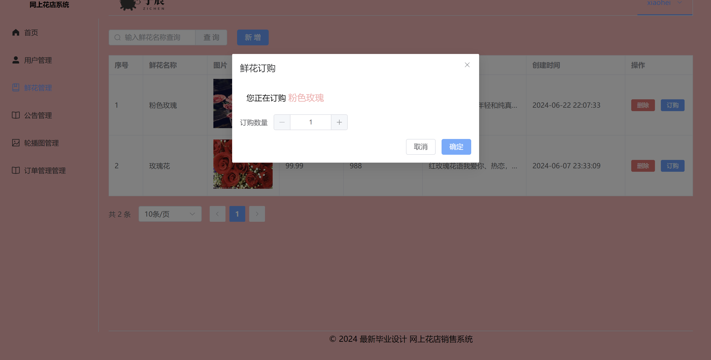


- 请求接口，`src/apis/order.js`

  ```js
  import instance from "@/utils/http.js";
  
  // 订购鲜花
  export function purchaseFlowerRequest({flower,quantity}) {
      return instance({
          url: 'order/',
          method: 'post',
          data: {
              flower,quantity
          }
      })
  }
  ```


- 鲜花订购，`src/views/flower/Flower.vue`

  ```vue
  <template>
      <div class="container">
  
          <div class="nav">
              <div>
                  <el-input v-model="input_flower" style="width: 240px" placeholder="输入鲜花名称查询">
                      <template #prefix>
                          <el-icon class="el-input__icon">
                              <search/>
                          </el-icon>
                      </template>
                      <template #append>
                          <el-button @click="searchFlower">查 询</el-button>
                      </template>
                  </el-input>
              </div>
              <div class="add_btn">
                  <el-button type="primary" class="btn" @click="dialogVisible = true">新 增</el-button>
              </div>
          </div>
  
          <!--表格数据-->
          <div class="table">
              <el-table :data="tableData.slice((currentPage-1)*pageSize,currentPage*pageSize)" border style="width: 100%">
                  <el-table-column label="序号" width="70" type="index" :index="indexMethod"
                                   style="background-color: #ffb0b0"/>
                  <el-table-column prop="name" label="鲜花名称" width="130"/>
                  <el-table-column prop="cover_url" label="图片" width="146">
                      <template #default="scope">
                          <el-image style="width: 120px; height: 100px"
                                    :src="scope.row.image"></el-image>
  
                      </template>
                  </el-table-column>
                  <el-table-column prop="price" label="鲜花价格" width="130"/>
                  <el-table-column prop="stock" label="剩余数量" width="160"/>
                  <el-table-column prop="flower_language" label="花语" width="210" show-overflow-tooltip/>
                  <el-table-column prop="create_time" label="创建时间" width="200"/>
  
                  <el-table-column label="操作" width="140">
                      <template #default="scope">
                          <el-button type="danger" @click="deleteFlower(scope.row)" size="small">删除</el-button>
                          <el-button type="primary" @click="PurchaseFlower(scope.row)" size="small">订购</el-button>
                      </template>
                  </el-table-column>
  
              </el-table>
  
  
              <!-- 页码展示-->
              <div style="margin-top: 20px">
  
                  <el-pagination
                          :current-page="currentPage"
                          :page-size="pageSize"
                          :page-sizes="[10, 20, 30, 40,50]"
                          background
                          layout="total,sizes, prev, pager, next"
                          :total="tableData.length"
                          @size-change="handleSizeChange"
                          @current-change="handleCurrentChange"
                  />
              </div>
          </div>
  
      </div>
  
  
    <!--  添加鲜花-->
      <el-dialog
              v-model="dialogVisible"
              title="添加鲜花"
              width="500"
              :close-on-click-modal="false"
      >
          <template #footer>
              <div class="dialog-footer">
                  <el-form
                          ref="ruleFormRef"
                          style="max-width: 600px"
                          label-width="auto">
  
                      <el-form-item label="鲜花名称" prop="name">
                          <el-input v-model="name" style="width: 100%" placeholder="输入鲜花名称"></el-input>
                      </el-form-item>
  
                      <el-form-item label="花语" prop="flower_language">
                          <el-input v-model="flower_language" style="width: 100%" placeholder="花语"></el-input>
                      </el-form-item>
  
                      <el-form-item label="鲜花总数量" prop="stock">
                          <el-input v-model="stock" style="width: 100%" placeholder="数量"></el-input>
                      </el-form-item>
  
                      <el-form-item label="鲜花价格" prop="price">
                          <el-input-number v-model="price" :precision="2" :step="0.1"/>
                      </el-form-item>
  
                      <div class="btn-addFlower">
                          <span style="color: #606266;font-size: 14px; margin-left: 15px;">鲜花图片</span>
                          <input type="file" style="margin-left: 12px" @change="flowerChange">
                          
                      </div>
  
  
                  </el-form>
  
                  <el-button @click="dialogVisible = false">取消</el-button>
                  <el-button type="primary" @click="addFlower">
                      确定
                  </el-button>
              </div>
          </template>
      </el-dialog>
  
  
    <!--  订购鲜花-->
      <el-dialog
              v-model="FlowerDialogVisible"
              title="鲜花订购"
              width="500"
              :close-on-click-modal="false"
      >
          <template #footer>
              <div class="dialog-footer">
                  <el-form
                          ref="ruleFormRef"
                          style="max-width: 600px"
                          label-width="auto">
  
                      <el-form-item>
                          <div class="flower-title">您正在订购 <span class="text">{{ flower_name }}</span></div>
                      </el-form-item>
  
                      <el-form-item label="订购数量" prop="price">
                          <el-input-number v-model="num" :min="1" :max="10" @change="handleChange"/>
                      </el-form-item>
  
                  </el-form>
  
                  <el-button @click="FlowerDialogVisible = false">取消</el-button>
                  <el-button type="primary" @click="purchaseFlower">
                      确定
                  </el-button>
              </div>
          </template>
      </el-dialog>
  
  </template>
  
  <script setup>
  import {ref, onMounted} from "vue";
  import {ElMessage} from "element-plus";
  import {FlowerRequest, DelFlowerRequest, addFlowerRequest} from "@/apis/flower.js";
  import {Search} from "@element-plus/icons-vue";
  import usePage from "@/hooks/usePage.js";
  import {purchaseFlowerRequest} from "@/apis/order.js";
  
  
  // 查询输入框
  const input_flower = ref('')
  const tableData = ref([])  // 表格数据
  const {
      pageSize,
      currentPage,
      handleSizeChange,
      handleCurrentChange,
      indexMethod
  } = usePage()  // 分页
  const dialogVisible = ref(false)  // 弹出框
  const FlowerDialogVisible = ref(false)  // 订购鲜花弹出框
  const previewImg = ref('')  // 预览图
  const name = ref('')  // 鲜花名
  const flower_language = ref('')  // 花语
  const price = ref('')  // 价格
  const stock = ref('')  // 添加鲜花数量
  const num = ref(1)  // 订购鲜花数量
  const flower_name = ref('')  // 鲜花名字
  const flower_id = ref(null)  // 鲜花id
  
  async function flowerChange(e) {
      const file = e.target.files[0];
      // 创建文件读取器
      const reader = new FileReader();
      reader.onload = e => {
          const dataUrl = e.target.result
          previewImg.value = dataUrl
      }
      // 以DataUrl格式读取文件
      reader.readAsDataURL(file);
  }
  
  // 新增鲜花
  async function addFlower() {
      const res = await addFlowerRequest({
          name: name.value,
          price: price.value,
          flower_language: flower_language.value,
          image: previewImg.value,
          stock: stock.value
      })
      ElMessage.success('添加成功')
      dialogVisible.value = false
      getFlowerList()
  
  }
  
  
  // 发送请求获取轮播图列表
  async function getFlowerList() {
      const res = await FlowerRequest()
      tableData.value = res
      console.log(res)
  }
  
  onMounted(() => getFlowerList())
  
  // 删除逻辑
  async function deleteFlower(row) {
      await DelFlowerRequest(row.id)
      getFlowerList()
      ElMessage({
          type: "success",
          message: '删除成功'
      })
  }
  
  
  // 查询功能
  // 根据鲜花名称进行查询
  async function searchFlower() {
      const res = await FlowerRequest(input_flower.value)
      tableData.value = res
  }
  
  
  // 订购鲜花按键
  function PurchaseFlower(row) {
      FlowerDialogVisible.value = true
      flower_name.value = row.name
      flower_id.value = row.id
  }
  
  
  // 订购鲜花发送请求
  async function purchaseFlower() {
      const res = await purchaseFlowerRequest(
          {
              flower: flower_id.value,
              quantity: num.value
          }
      )
     ElMessage.success('订购成功')
      getFlowerList()
      FlowerDialogVisible.value = false
  }
  
  </script>
  
  <style scoped>
  
  
  .btn {
      margin-bottom: 20px;
  }
  
  .avatar-uploader .avatar {
      width: 150px;
      height: 150px;
      display: block;
  }
  </style>
  
  <style>
  .avatar-uploader .el-upload {
      border: 1px dashed var(--el-border-color);
      border-radius: 6px;
      cursor: pointer;
      position: relative;
      overflow: hidden;
      transition: var(--el-transition-duration-fast);
  }
  
  .avatar-uploader .el-upload:hover {
      border-color: var(--el-color-primary);
  }
  
  
  .block .demonstration {
      display: block;
      color: var(--el-text-color-secondary);
      font-size: 14px;
      margin-bottom: 20px;
  }
  
  .nav {
      display: flex;
      flex-direction: row;
  }
  
  .add_btn {
      margin-left: 20px;
  }
  
  .btn-addFlower {
      display: flex;
      flex-direction: row;
      justify-content: left;
  }
  
  #preview {
      height: 120px;
      width: 100px;
      margin-bottom: 20px;
      margin-left: -63px;
  }
  
  .flower-title {
      margin-left: 13px;
      font-size: 16px;
  }
  
  .text {
      color: #ffb0b0;
      font-size: 18px;
  }
  
  </style>
  ```

  


## 3. 用户管理

- 页面展示

  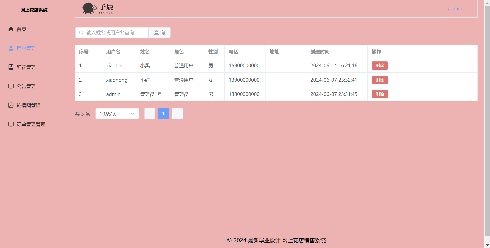

- 请求接口，`src/apis/user.js`

  ```js
  import instance from "@/utils/http.js";
  
  
  // ######################## 用户 #################################
  // 获取用户列表
  export function getUserRequest() {
      return instance({
          url: 'user/',
      })
  }
  
  
  export function getUserNameRequest(name) {
      return instance({
          url: 'user/',
          params:{
              name
          }
      })
  }
  
  
  
  
  
  // 删除
  export function deleteUserRequest(id) {
      return instance({
          url: 'user/' + id + '/',
          method: 'delete',
  
      })
  }
  ```

  

- 代码，`src/view/user/User.vue`

  ```vue
  <template>
      <div class="container">
  
          <!-- 搜索-->
          <div class="input_search">
              <el-input v-model="input_name" style="width: 280px; margin-left: 20px" placeholder="输入姓名或用户名查询">
                  <template #prefix>
                      <el-icon class="el-input__icon">
                          <search/>
                      </el-icon>
                  </template>
                  <template #append>
                      <el-button @click="searchName">查 询</el-button>
                  </template>
              </el-input>
  
          </div>
  
          <!--表格数据-->
          <div class="table">
              <el-table :data="tableData.slice((currentPage-1)*pageSize,currentPage*pageSize)" border style="width: 100%">
                  <el-table-column label="序号" width="80" type="index" :index="indexMethod"/>
                  <el-table-column prop="username" label="用户名" width="100"/>
                  <el-table-column prop="name" label="姓名" width="100"/>
                  <el-table-column prop="role_text" label="角色" width="100"/>
                  <el-table-column prop="sex_text" label="性别" width="60"/>
                  <el-table-column prop="phone" label="电话" width="120"/>
                  <el-table-column prop="addr" label="地址" width="120"/>
                  <el-table-column prop="create_time" label="创建时间" width="180"/>
  
                  <el-table-column label="操作">
                      <template #default="scope">
                          <el-button type="danger" @click="deleteUser(scope.row)" size="small">删除</el-button>
                      </template>
                  </el-table-column>
  
              </el-table>
  
  
              <!-- 页码展示-->
              <div style="margin-top: 20px">
  
                  <el-pagination
                          :current-page="currentPage"
                          :page-size="pageSize"
                          :page-sizes="[10, 20, 30, 40,50]"
                          background
                          layout="total,sizes, prev, pager, next"
                          :total="tableData.length"
                          @size-change="handleSizeChange"
                          @current-change="handleCurrentChange"
                  />
              </div>
          </div>
  
      </div>
  
  
  </template>
  
  <script setup>
  import {ref, onMounted} from "vue";
  import {Search} from '@element-plus/icons-vue'
  import {getUserRequest,deleteUserRequest,getUserNameRequest} from "@/apis/user.js";
  import {ElMessage} from "element-plus";
  import usePage from "@/hooks/usePage.js";
  
  
  // 查询输入框
  const input_name = ref('')
  
  // 表格数据
  const tableData = ref([])
  
  const {
      pageSize,
      currentPage,
      handleSizeChange,
      handleCurrentChange,
      indexMethod
  } = usePage()  // 分页
  
  // 发送请求获取用户列表
  async function getUserList() {
      const res = await getUserRequest()
      tableData.value = res
  }
  
  onMounted(() => getUserList())
  
  
  // 删除逻辑
  async function deleteUser(row) {
      await deleteUserRequest(row.id)
      ElMessage({
          type: "success",
          message: '删除成功'
      })
      getUserList()
  }
  
  
  // 查询功能
  // 根据姓名进行查询
  async function searchName() {
      const res = await getUserNameRequest(input_name.value)
      tableData.value = res
  }
  
  </script>
  
  <style scoped>
  .table {
      margin-top: 20px;
  }
  
  
  .input_search {
   margin-left: -19px;
  }
  </style>
  ```


## 4. 登录注册功能

- 登录页面展示

  

- 注册页面展示

  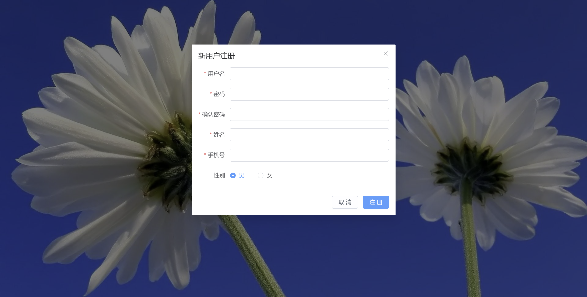

- 登录请求接口，`src/api/login.js`

  ```js
  import instance from "@/utils/http.js";
  
  
  export function LoginRequest({username,password}){
      return instance({
          url:'login/',
          method:"POST",
          data:{
              username,
              password
          }
      })
  }
  ```

  

- 注册请求接口，`src/api/register.js`

  ```js
  import instance from "@/utils/http.js";
  
  
  export function RegisterRequest({
                                      username,
                                      password,
                                      confirm_password,
                                      name,
                                      phone,
                                      sex
                                  }) {
      return instance({
          url: 'register/',
          method: "POST",
          data: {
              username,
              password,
              confirm_password,
              name,
              phone,
              sex,
          }
      })
  }
  ```

- 登录注册页面，`src/views/account/Login.vue`

  ```vue
  <template>
      <div class="container">
          <!-- 登录表单-->
          <div class="login-box">
              <h2>网上花店系统</h2>
              <el-form
                      style="max-width: 600px"
                      :model="ruleForm"
                      :rules="rules"
                      label-width="auto"
                      class="demo-ruleForm"
                      status-icon
              >
                  <el-form-item prop="username">
                      <el-input v-model="ruleForm.username" type="text" placeholder="用户名">
                          <template #prefix>
                              <el-icon class="el-input__icon">
                                  <User/>
                              </el-icon>
                          </template>
                      </el-input>
                  </el-form-item>
  
                  <el-form-item prop="password">
                      <el-input v-model="ruleForm.password" type="password" placeholder="密码" show-password>
                          <template #prefix>
                              <el-icon class="el-input__icon">
                                  <Lock/>
                              </el-icon>
                          </template>
                      </el-input>
                  </el-form-item>
  
                  <el-form-item>
                      <el-button class="login-btn" type="success" @click="onSubmit">登 录</el-button>
  
                      <span style="margin-left: 167px; margin-top: 10px; color: #AAAAAA">没有账号，
                          <el-button type="text" @click="dialogFormVisible = true">立即注册</el-button>
                      </span>
                  </el-form-item>
              </el-form>
          </div>
  
          <!-- 对话框-->
          <el-dialog v-model="dialogFormVisible" title="新用户注册" width="500" :close-on-click-modal="false">
              <el-form :model="form" :rules="registerForm" label-width="auto">
  
                  <el-form-item label="用户名" prop="username">
                      <el-input v-model="form.username" autocomplete="off" clearable/>
                  </el-form-item>
  
  
                  <el-form-item label="密码" prop="password">
                      <el-input v-model="form.password" autocomplete="off" type="password" clearable show-password/>
                  </el-form-item>
  
                  <el-form-item label="确认密码" prop="password">
                      <el-input v-model="form.confirm_password" autocomplete="off" type="password" clearable show-password/>
                  </el-form-item>
  
                  <el-form-item label="姓名" prop="name">
                      <el-input v-model="form.name" autocomplete="off" clearable/>
                  </el-form-item>
  
                  <el-form-item label="手机号" prop="phone">
                      <el-input v-model="form.phone" autocomplete="off" clearable/>
                  </el-form-item>
  
                  <el-form-item label="性别">
                      <el-radio-group v-model="form.sex" class="ml-4">
                          <el-radio value="1">男</el-radio>
                          <el-radio value="0">女</el-radio>
                      </el-radio-group>
                  </el-form-item>
  
  
              </el-form>
              <template #footer>
                  <div class="dialog-footer">
                      <el-button @click="dialogFormVisible = false">取 消</el-button>
                      <el-button type="primary" @click="onRegister">
                          注 册
                      </el-button>
                  </div>
              </template>
          </el-dialog>
  
      </div>
  
  </template>
  
  <script setup>
  
  import {reactive, ref} from 'vue'
  import {LoginRequest} from "@/apis/login.js";
  import {RegisterRequest} from "@/apis/register.js";
  import {ElMessage} from "element-plus";
  import {useRouter} from "vue-router";
  import {Lock, User} from '@element-plus/icons-vue'
  import useUser from "@/hooks/useUser.js";
  
  
  // hooks中的数据
  const {registerForm,rules} = useUser()
  
  // 实例化useRouter对象
  const router = useRouter()
  
  // 对话框是否显示
  const dialogFormVisible = ref(false)
  
  // 对话框数据
  const form = reactive({
      password: '',
      name: '',
      phone: '',
      username: '',
      sex: "1",
      confirm_password:''
  })
  
  
  // 定义表单登录数据
  const ruleForm = reactive({
      username: '',
      password: ''
  })
  
  // 点击登录按钮发送请求
  async function onSubmit() {
      const res = await LoginRequest({username: ruleForm.username, password: ruleForm.password})
      console.log(res)
      if (res.code === 1001) {
          ElMessage({
              message: "用户名或密码错误",
              type: 'error'
          })
      } else {
          ElMessage({
              message: '登录成功',
              type: 'success'
          })
          // 登录成功保存token
          localStorage.setItem('token', res.token)
          localStorage.setItem('username', res.username)
          localStorage.setItem('role', res.role)
          // localStorage.setItem('user_id', res.data.user_id)
          // 登录成功跳转到管理员首页
          router.replace({path: '/home'})
  
      }
  
  }
  
  
  // 用户注册
  async function onRegister() {
      try {
          const res = await RegisterRequest({
              username: form.username,
              password: form.password,
              name: form.name,
              phone: form.phone,
              sex: form.sex,
              confirm_password:form.confirm_password,
          })
          ElMessage({
              type:'success',
              message:'注册完成，请登录'
          })
          dialogFormVisible.value = false
  
      }catch (e) {
          if (e.response.data.name){
              ElMessage({
                  type:'error',
                  message:'姓名已存在'
              })
          }
  
          if (e.response.data.confirm_password){
              ElMessage({
                  type:'error',
                  message:'两次密码不一致'
              })
          }
  
  
          if (e.response.data.phone){
              ElMessage({
                  type:'error',
                  message:'手机号已存在'
              })
          }
  
  
          if (e.response.data.username){
              ElMessage({
                  type:'error',
                  message:'用户名已存在'
              })
          }
  
      }
  }
  
  
  
  </script>
  
  
  <style scoped>
  
  
  .container {
      display: flex;
      justify-content: center;
      align-items: center;
      height: 100vh;
  
      font-family: Arial, sans-serif;
      margin: 0;
      padding: 0;
      background-image: url('@/assets/flower.png');
      background-size: cover;
      background-position: center;
  
  }
  
  .login-box {
      background-color: rgba(255, 255, 255, 0.1); /* 透明度为0.7的白色背景 */
      border-radius: 10px;
      box-shadow: 0 0 10px rgba(0, 0, 0, 0.1);
      padding: 20px;
      width: 300px;
  }
  
  .login-box h2 {
      text-align: center;
      margin-bottom: 20px;
  }
  
  .login-box input[type="text"],
  .login-box input[type="password"] {
      width: 100%;
      padding: 10px;
      border: 1px solid #ccc;
      border-radius: 5px;
      margin-bottom: 15px;
      box-sizing: border-box;
  }
  
  .login-box input[type="submit"] {
      width: 100%;
      background-color: #4caf50;
      color: #fff;
      border: none;
      padding: 10px;
      border-radius: 5px;
      cursor: pointer;
  }
  
  .login-box input[type="submit"]:hover {
      background-color: #45a049;
  
  }
  
  .login-btn {
      width: 100%;
  }
  </style>
  ```

  

- 公共页面，`src/views/Layout.vue`

  ```vue
  <template>
      <div class="common-layout">
          <el-container>
  
              <!-- 左侧菜单栏-->
              <el-aside width="200px">
  
                  <el-col :span="100" style="height: 100vh;">
                      <h5 class="mb-3" style="margin:20px 60px">网上花店系统</h5>
                      <el-menu
                              :default-active="index"
                              class="el-menu-vertical-demo"
                      >
                          <el-menu-item index="1">
                              <el-icon>
                                  <HomeFilled/>
                              </el-icon>
                              <span @click="goHome">首页</span>
                          </el-menu-item>
  
                          <el-menu-item index="2">
                              <el-icon>
                                  <user-filled/>
                              </el-icon>
                              <span @click="goUser">用户管理</span>
                          </el-menu-item>
  
                          <el-menu-item index="3">
                              <el-icon>
                                  <Collection/>
                              </el-icon>
                              <span @click="goFlower">鲜花管理</span>
                          </el-menu-item>
  
  
                          <el-menu-item index="4">
                              <el-icon>
                                  <Reading/>
                              </el-icon>
                              <span @click="goAnnouncement">公告管理</span>
                          </el-menu-item>
  
                          <el-menu-item index="5">
                              <el-icon>
                                  <Picture/>
                              </el-icon>
                              <span @click="goBanner">轮播图管理</span>
                          </el-menu-item>
  
  
                          <el-menu-item index="6">
                              <el-icon>
                                  <Reading/>
                              </el-icon>
                              <span @click="goOrder">订单管理管理</span>
                          </el-menu-item>
  
                      </el-menu>
                  </el-col>
              </el-aside>
  
              <el-container>
                  <!-- 头部导航条-->
                  <el-header>
                      <el-menu
                              :default-active="activeIndex"
                              class="el-menu-demo"
                              mode="horizontal"
                              :ellipsis="false"
                      >
                          <el-menu-item index="0">
                              
                          </el-menu-item>
                          <div class="flex-grow"/>
                          <el-sub-menu index="2">
                              <template #title>{{ username }}</template>
                              <el-menu-item index="2-2" @click="logout">退出登录</el-menu-item>
                          </el-sub-menu>
                      </el-menu>
                  </el-header>
  
                  <!-- 内容区域-->
                  <el-main>
                      <RouterView></RouterView>
                  </el-main>
  
                  <!--脚部信息-->
                  <el-footer>
                      <div class="footer">
                          © 2024 最新毕业设计 图书管理系统项目
                      </div>
                  </el-footer>
  
              </el-container>
          </el-container>
      </div>
  </template>
  
  <script setup>
  import {ref, onMounted} from 'vue'
  import {useRouter} from "vue-router";
  import {
      HomeFilled,
      Avatar,
      UserFilled,
      Grid,
      Notebook,
      Collection,
      Promotion,
      Reading, Picture
  } from '@element-plus/icons-vue'
  
  
  const router = useRouter()  // 实例化useRouter对象
  // const {role} = useRole()  // 获取当前登录的角色信息
  const activeIndex = ref('2-2')  // 导航条菜单默认激活
  const username = localStorage.getItem('username')  // 获取当前登录人的用户名
  const index = ref('1')  // 左侧栏默认激活
  
  // 退出登录
  function logout() {
      localStorage.clear()
      router.push({path: '/login'})
  
  }
  
  // 页面刷新跳转回首页
  onMounted(() => {
      router.push({path: "/home"})
  })
  
  
  // 跳转到首页
  function goHome() {
      router.push({path: '/home'})
  }
  
  
  // 跳转到用户管理页面
  function goUser() {
      router.push({path: '/user'})
  }
  
  // 跳转到鲜花管理页面
  function goFlower() {
      router.push({path: '/flower'})
  }
  
  
  // 跳转到订单管理页面
  function goOrder() {
      router.push({path: '/order'})
  }
  
  // 跳转到公告页面
  function goAnnouncement() {
      router.push({path: '/announcement'})
  }
  
  // 跳转到轮播图
  function goBanner() {
      router.push({path: '/banner'})
  }
  
  
  </script>
  
  <style scoped>
  .flex-grow {
      flex-grow: 1;
  }
  
  .el-menu {
      background-color: var(--el-menu-bg-color);
      border-right: 1px solid #dcdfe6;
      height: 87%;
      box-sizing: border-box;
      list-style: none;
      margin: 0;
      padding-left: 0;
      position: relative;
  }
  
  .footer {
      text-align: center;
      border-top: 1px solid #dcdfe6;
      height: 30px;
      line-height: 30px;
  }
  </style>
  ```
  
  


## 5. 公告管理

- 页面展示

  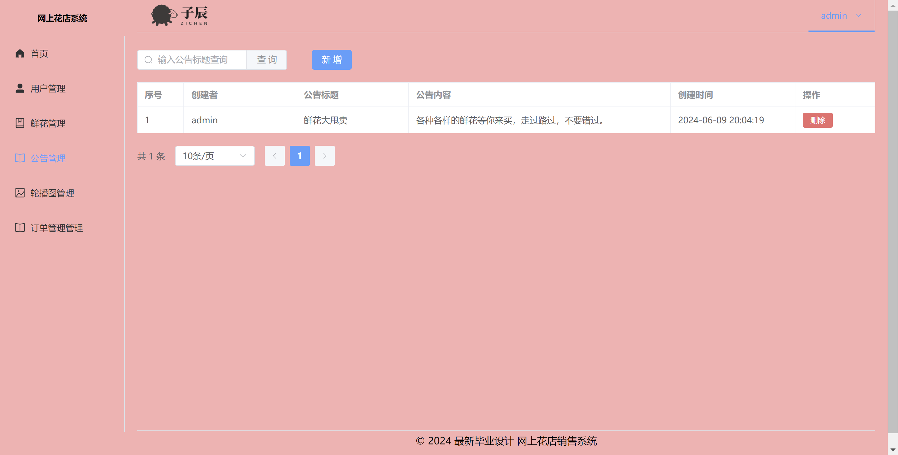


- 请求接口，`src/api/announcement.js`

  ```js
  import instance from "@/utils/http.js";
  
  
  // ######################## 公告 #################################
  export function getAnnouncementRequest(title) {
      return instance({
          url: 'announcement/',
          params: {
              title
          }
      })
  }
  
  
  // 新增
  export function addAnnouncementRequest({
                                             title,
                                             content,
  
                                         }) {
      return instance({
          url: 'announcement/',
          method: 'POST',
          data: {
              title,
              content,
  
          }
      })
  }
  
  
  // 删除
  export function deleteAnnouncementRequest(id) {
      return instance({
          url: 'announcement/' + id + '/',
          method: 'delete',
  
      })
  }
  
  
  ```

- 页面，`src/views/announcement/Announcement.vue`

  ```vue
  <template>
      <div class="container">
  <div class="nav">
          <!-- 搜索-->
          <div class="input_search">
              <el-input v-model="input" style="width: 240px; margin-right: 20px" placeholder="输入公告标题查询">
                  <template #prefix>
                      <el-icon class="el-input__icon">
                          <search/>
                      </el-icon>
                  </template>
                  <template #append>
                      <el-button @click="searchAnnouncement">查 询</el-button>
                  </template>
              </el-input>
  
  
          </div>
          <div class="add_btn">
              <el-button type="primary" class="btn" @click="dialogVisible = true">新 增</el-button>
          </div>
  </div>
          <!--表格数据-->
          <div class="table">
  
              <el-table :data="tableData.slice((currentPage-1)*pageSize,currentPage*pageSize)" border style="width: 100%">
                  <el-table-column label="序号" width="75" type="index" :index="indexMethod"/>
                  <el-table-column prop="username" label="创建者" width="180"/>
                  <el-table-column prop="title" label="公告标题" width="180"/>
                  <el-table-column prop="content" label="公告内容" width="420" show-overflow-tooltip/>
                  <el-table-column prop="create_time" label="创建时间" width="200"/>
  
                  <el-table-column label="操作" width="140">
                      <template #default="scope">
                          <el-button type="danger" @click="deleteAnnouncement(scope.row)" size="small">删除</el-button>
                      </template>
                  </el-table-column>
  
              </el-table>
  
  
              <!-- 页码展示-->
              <div style="margin-top: 20px">
  
                  <el-pagination
                          :current-page="currentPage"
                          :page-size="pageSize"
                          :page-sizes="[10, 20, 30, 40,50]"
                          background
                          layout="total,sizes, prev, pager, next"
                          :total="tableData.length"
                          @size-change="handleSizeChange"
                          @current-change="handleCurrentChange"
                  />
              </div>
          </div>
  
      </div>
  
  
      <el-dialog
              v-model="dialogVisible"
              title="添加公告"
              width="500"
      >
          <template #footer>
              <div class="dialog-footer">
                  <el-form
                          ref="ruleFormRef"
                          style="max-width: 600px"
                          :model="Announcement"
                          label-width="auto">
                      <el-form-item label="标题" prop="title">
                          <el-input v-model="Announcement.title"/>
                      </el-form-item>
  
                      <el-form-item label="内容" prop="content">
                          <el-input v-model="Announcement.content"/>
                      </el-form-item>
                  </el-form>
                  <el-button @click="dialogVisible = false">取消</el-button>
                  <el-button type="primary" @click="addAnnouncement">
                      确定
                  </el-button>
              </div>
          </template>
      </el-dialog>
  
  </template>
  
  <script setup>
  import {ref, onMounted, reactive} from "vue";
  import {Search} from '@element-plus/icons-vue'
  import {ElMessage} from "element-plus";
  import {addAnnouncementRequest, deleteAnnouncementRequest, getAnnouncementRequest} from "@/apis/announcement.js";
  import useRole from "@/hooks/useRole.js";
  import usePage from "@/hooks/usePage.js";
  
  
  const Announcement = reactive({title: '', content: ''})  // 添加公告表单
  const input = ref('')  // 查询输入框
  const tableData = ref([])  // 表格数据
  const {
      pageSize,
      currentPage,
      handleSizeChange,
      handleCurrentChange,
      indexMethod
  } = usePage()  // 分页
  const {role} = useRole()  // 获取当前登录的角色信息
  const dialogVisible = ref(false)  // 弹出框
  
  
  // 发送请求获取公告列表
  async function getAnnouncementList() {
      const res = await getAnnouncementRequest()
      tableData.value = res
  }
  
  onMounted(() => getAnnouncementList())
  
  
  const user_id = localStorage.getItem('user_id')
  
  
  // 查询功能
  async function searchAnnouncement() {
      const res = await getAnnouncementRequest(input.value)
      tableData.value = res
  }
  
  
  // 删除逻辑
  async function deleteAnnouncement(row) {
      await deleteAnnouncementRequest(row.id)
      getAnnouncementList()
      ElMessage({
          type: "success",
          message: '删除成功'
      })
  }
  
  // 新增公告弹框确定按钮
  async function addAnnouncement() {
  
          const res = await addAnnouncementRequest({
              title: Announcement.title,
              content: Announcement.content,
          })
          ElMessage({
              type: "success",
              message: "公告添加成功！！！"
          })
          getAnnouncementList()
          dialogVisible.value = false
  
  
  
  }
  
  </script>
  
  <style scoped>
  .table {
      margin-top: 20px;
  }
  
  
  
  .avatar-uploader .avatar {
      width: 150px;
      height: 150px;
      display: block;
  }
  </style>
  
  <style>
  .avatar-uploader .el-upload {
      border: 1px dashed var(--el-border-color);
      border-radius: 6px;
      cursor: pointer;
      position: relative;
      overflow: hidden;
      transition: var(--el-transition-duration-fast);
  }
  
  .avatar-uploader .el-upload:hover {
      border-color: var(--el-color-primary);
  }
  
  
  .block .demonstration {
      display: block;
      color: var(--el-text-color-secondary);
      font-size: 14px;
      margin-bottom: 20px;
  }
  
  </style>
  ```
  
  

## 6. 轮播图管理

- 页面展示

  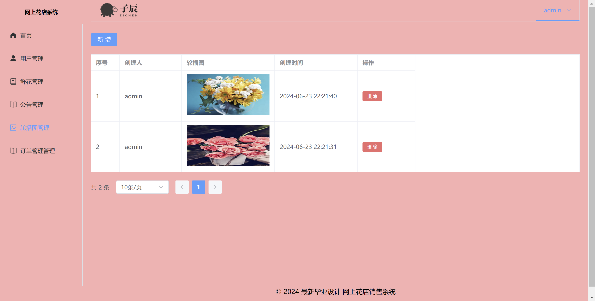

- 请求接口，`api/banner.js`

  ```js
  import instance from "@/utils/http.js";
  
  
  // ######################## 轮播图 #################################
  export function getBannerRequest() {
      return instance({
          url: 'banner/',
      })
  }
  
  
  // 新增
  export function addBannerRequest({image}) {
      return instance({
          url: 'banner/',
          method: 'POST',
          data: {
              image,
          }
      })
  }
  
  
  // 删除
  export function deleteBannerRequest(id) {
      return instance({
          url: 'banner/' + id + '/',
          method: 'delete',
  
      })
  }
  
  
  ```

  

- 页面，`src/views/banner/Banner.vue`

  ```vue
  <template>
      <div class="container">
  
          <!--表格数据-->
          <div class="table">
              <el-button type="primary" class="btn" @click="dialogVisible = true">新 增</el-button>
  
              <el-table :data="tableData.slice((currentPage-1)*pageSize,currentPage*pageSize)" border style="width: 100%">
                  <el-table-column label="序号" width="70" type="index" :index="indexMethod"/>
                  <el-table-column prop="username" label="创建人" width="150"/>
  
                  <el-table-column prop="cover_url" label="轮播图" width="225">
                      <template #default="scope">
                          <el-image style="width: 200px; height: 100px"
                                    :src="scope.row.image"></el-image>
  
                      </template>
                  </el-table-column>
  
                  <el-table-column prop="create_time" label="创建时间" width="200"/>
  
                  <el-table-column label="操作" width="140">
                      <template #default="scope">
                          <el-button type="danger" @click="deleteBanner(scope.row)" size="small">删除</el-button>
                      </template>
                  </el-table-column>
  
              </el-table>
  
  
              <!-- 页码展示-->
              <div style="margin-top: 20px">
  
                  <el-pagination
                          :current-page="currentPage"
                          :page-size="pageSize"
                          :page-sizes="[10, 20, 30, 40,50]"
                          background
                          layout="total,sizes, prev, pager, next"
                          :total="tableData.length"
                          @size-change="handleSizeChange"
                          @current-change="handleCurrentChange"
                  />
              </div>
          </div>
  
      </div>
  
  
    <!--  添加轮播图-->
      <el-dialog
              v-model="dialogVisible"
              title="添加轮播图"
              width="500"
      >
          <template #footer>
              <div class="dialog-footer">
                  <el-form
                          ref="ruleFormRef"
                          style="max-width: 600px"
                          label-width="auto">
  
                      <div class="btn-addFlower">
                          <span style="color: #606266;font-size: 14px; margin-left: 15px;">鲜花图片</span>
                          <input type="file" style="margin-left: 12px" @change="flowerChange">
                          
                      </div>
  
                  </el-form>
                  <el-button @click="dialogVisible = false">取消</el-button>
                  <el-button type="primary" @click="addBanner">
                      确定
                  </el-button>
              </div>
          </template>
      </el-dialog>
  
  </template>
  
  <script setup>
  import {ref, onMounted} from "vue";
  import {ElMessage} from "element-plus";
  import {addBannerRequest, deleteBannerRequest, getBannerRequest} from "@/apis/banner.js";
  import usePage from "@/hooks/usePage.js";
  
  const previewImg = ref('')  // 预览图
  const tableData = ref([])  // 表格数据
  const {
      pageSize,
      currentPage,
      handleSizeChange,
      handleCurrentChange,
      indexMethod
  } = usePage()  // 分页
  const dialogVisible = ref(false)  // 弹出框
  
  
  // 发送请求获取轮播图列表
  async function getBannerList() {
      const res = await getBannerRequest()
      tableData.value = res
      console.log(res)
  }
  onMounted(() => getBannerList())
  
  // 删除逻辑
  async function deleteBanner(row) {
      await deleteBannerRequest(row.id)
      getBannerList()
      ElMessage({
          type: "success",
          message: '删除成功'
      })
  }
  
  // 新增轮播图弹框确定按钮
  async function addBanner() {
      const res = await addBannerRequest({
          image: previewImg.value,
      })
      ElMessage({
          type: "success",
          message: "轮播图添加成功！！！"
      })
      dialogVisible.value = false
      getBannerList()
  
  }
  
  // 读取图片信息
  async function flowerChange(e) {
      const file = e.target.files[0];
      // 创建文件读取器
      const reader = new FileReader();
      reader.onload = e => {
          const dataUrl = e.target.result
          previewImg.value = dataUrl
      }
      // 以DataUrl格式读取文件
      reader.readAsDataURL(file);
  }
  
  </script>
  
  <style scoped>
  
  
  .btn {
      margin-bottom: 20px;
  }
  
  .avatar-uploader .avatar {
      width: 150px;
      height: 150px;
      display: block;
  }
  </style>
  
  <style>
  .avatar-uploader .el-upload {
      border: 1px dashed var(--el-border-color);
      border-radius: 6px;
      cursor: pointer;
      position: relative;
      overflow: hidden;
      transition: var(--el-transition-duration-fast);
  }
  
  .avatar-uploader .el-upload:hover {
      border-color: var(--el-color-primary);
  }
  
  
  .block .demonstration {
      display: block;
      color: var(--el-text-color-secondary);
      font-size: 14px;
      margin-bottom: 20px;
  }
  
  </style>
  ```
  
  


## 7. 订单列表

- 页面展示

  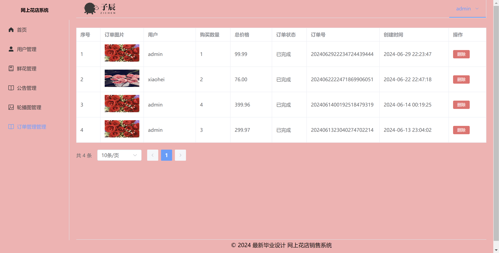


- 请求接口，`api/order.js`

  ```js
  import instance from "@/utils/http.js";
  
  
  // 订单列表
  export function OrderListRequest() {
      return instance({
          url: 'order/',
      })
  }
  
  
  // 删除订单
  export function deleteOrderRequest(id) {
      return instance({
          url: 'order/' + id + '/',
          method:'delete'
      })
  }
  
  
  
  ```

- 页面，`src/views/user/Order.vue`

  ```vue
  <template>
      <div class="container">
  
          <!--表格数据-->
          <div class="table">
  
              <el-table :data="tableData.slice((currentPage-1)*pageSize,currentPage*pageSize)" border style="width: 100%">
                  <el-table-column label="序号" width="70" type="index" :index="indexMethod"/>
                  <el-table-column prop="cover_url" label="订单图片" width="125">
                      <template #default="scope">
                          <el-image style="width: 100px; height: 50px"
                                    :src="scope.row.flower_img"></el-image>
  
                      </template>
                  </el-table-column>
                  <el-table-column prop="username" label="用户" width="150"/>
                  <el-table-column prop="quantity" label="购买数量" width="100"/>
                  <el-table-column prop="total_price" label="总价格" width="120"/>
                  <el-table-column prop="order_status_text" label="订单状态" width="100"/>
                  <el-table-column prop="order_num" label="订单号" width="210"/>
                  <el-table-column prop="create_time" label="创建时间" width="200"/>
  
                  <el-table-column label="操作" width="140">
                      <template #default="scope">
                          <el-button type="danger" @click="deleteOrder(scope.row)" size="small">删除</el-button>
                      </template>
                  </el-table-column>
  
              </el-table>
  
  
              <!-- 页码展示-->
              <div style="margin-top: 20px">
  
                  <el-pagination
                          :current-page="currentPage"
                          :page-size="pageSize"
                          :page-sizes="[10, 20, 30, 40,50]"
                          background
                          layout="total,sizes, prev, pager, next"
                          :total="tableData.length"
                          @size-change="handleSizeChange"
                          @current-change="handleCurrentChange"
                  />
              </div>
          </div>
  
      </div>
  
  
    <!--  添加轮播图-->
      <el-dialog
              v-model="dialogVisible"
              title="添加轮播图"
              width="500"
      >
          <template #footer>
              <div class="dialog-footer">
                  <el-form
                          ref="ruleFormRef"
                          style="max-width: 600px"
                          label-width="auto">
                      <el-form-item label="轮播图链接" prop="link">
                          <el-input v-model="img_url" style="width: 100%" placeholder="输入轮播图链接">
                              <template #prefix>
                                  <el-icon class="el-input__icon">
                                      <Link/>
                                  </el-icon>
                              </template>
                          </el-input>
                      </el-form-item>
  
                  </el-form>
                  <el-button @click="dialogVisible = false">取消</el-button>
                  <el-button type="primary" @click="addBanner">
                      确定
                  </el-button>
              </div>
          </template>
      </el-dialog>
  
  </template>
  
  <script setup>
  import {ref, onMounted} from "vue";
  import {ElMessage} from "element-plus";
  import {Link} from "@element-plus/icons-vue";
  import usePage from "@/hooks/usePage.js";
  import {OrderListRequest, deleteOrderRequest} from "@/apis/order.js";
  const tableData = ref([])  // 表格数据
  const {
      pageSize,
      currentPage,
      handleSizeChange,
      handleCurrentChange,
      indexMethod
  } = usePage()  // 分页
  
  
  // 发送请求获取订单列表
  async function getOrderList() {
      const res = await OrderListRequest()
      tableData.value = res
  }
  
  onMounted(() => getOrderList())
  
  // 删除逻辑
  async function deleteOrder(row) {
      console.log(row)
      await deleteOrderRequest(row.id)
      getOrderList()
      ElMessage({
          type: "success",
          message: '删除成功'
      })
  }
  
  
  </script>
  
  <style scoped>
  
  
  .avatar-uploader .avatar {
      width: 150px;
      height: 150px;
      display: block;
  }
  </style>
  
  <style>
  .avatar-uploader .el-upload {
      border: 1px dashed var(--el-border-color);
      border-radius: 6px;
      cursor: pointer;
      position: relative;
      overflow: hidden;
      transition: var(--el-transition-duration-fast);
  }
  
  .avatar-uploader .el-upload:hover {
      border-color: var(--el-color-primary);
  }
  
  
  .block .demonstration {
      display: block;
      color: var(--el-text-color-secondary);
      font-size: 14px;
      margin-bottom: 20px;
  }
  
  </style>
  ```

  

  

  

  

## 8. 首页

- 页面展示

  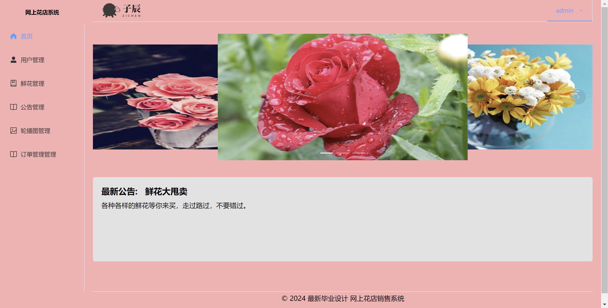


- 请求接口，`apis/banner.js、announcement.js`

  ```js
  import instance from "@/utils/http.js";
  
  
  // ######################## 轮播图 #################################
  export function getBannerRequest() {
      return instance({
          url: 'banner/',
      })
  }
  
  import instance from "@/utils/http.js";
  
  
  // ######################## 公告 #################################
  export function getAnnouncementRequest(title) {
      return instance({
          url: 'announcement/',
          params: {
              title
          }
      })
  }
  
  ```

- 页面，`src/views/user/AnnouncementView.vue`

  ```vue
  <template>
      <div>
          <el-carousel :interval="2000" type="card" height="300px">
              <el-carousel-item v-for="item in bannerList" :key="item.id">
                  <el-image :src="item.image" style="width: 100%;height: 300px"></el-image>
              </el-carousel-item>
          </el-carousel>
      </div>
  
      <div class="box_content">
          <div class="content" v-for="item in announcementList" :key="item.id">
              <span class="title">
                  最新公告: &nbsp;&nbsp;{{ item.title }}
              </span>
  
              <span>
                  {{ item.content }}
              </span>
          </div>
  
  
      </div>
  </template>
  
  <script setup>
  import {ref, onMounted} from "vue";
  import {getBannerRequest} from "@/apis/banner.js";
  import {getAnnouncementRequest} from "@/apis/announcement.js";
  
  
  const bannerList = ref('')  // 轮播图列表
  const announcementList = ref('')
  
  // 发送请求获取轮播图列表
  async function getBannerList() {
      const res = await getBannerRequest()
      bannerList.value = res
      console.log(res)
  }
  onMounted(() => getBannerList())
  
  
  // 发送请求获取公告列表
  async function getAnnouncementList() {
      const res = await getAnnouncementRequest()
      announcementList.value = res
  }
  onMounted(() => getAnnouncementList())
  
  
  </script>
  
  <style scoped>
  .el-carousel__item h3 {
      color: #475669;
      opacity: 0.75;
      line-height: 200px;
      margin: 0;
      text-align: center;
  }
  
  .el-carousel__item:nth-child(2n) {
      background-color: #99a9bf;
  }
  
  .el-carousel__item:nth-child(2n + 1) {
      background-color: #d3dce6;
  }
  
  .box_content {
      margin-top: 40px;
      background-color: #e2e2e2;
      height: 200px;
      border-radius: 5px;
  }
  
  
  .content {
      display: flex;
      flex-direction: column;
      padding: 20px;
  }
  
  .title {
      font-size: 20px;
      font-weight: 800;
      margin-bottom: 10px;
  }
  </style>
  ```

  

  

  

  

